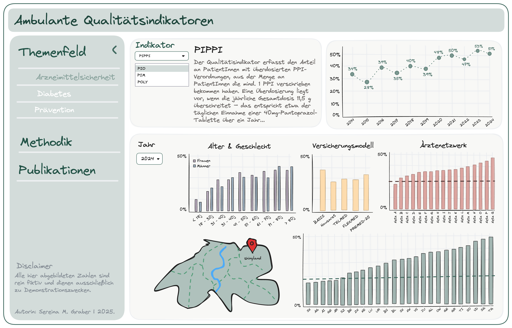
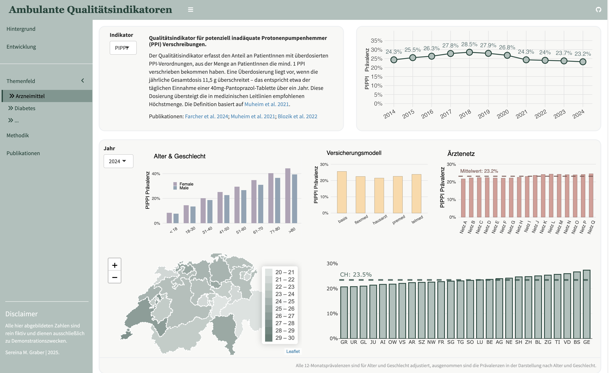

# Shiny Dashboard Skeleton

<!-- badges: start -->
<!-- badges: end -->

The main goal of this dashboard is to keep track of certain quality indicators for primary care in Switzerland. 
The dashboard is built using R and the Shiny framework.
The repository includes *only!* the dashboard application code. For privacy and data protection reasons, 
the underlying data is not included and must be provided/ generated separately by users implementing the dashboard.
The methodologies, definitions, and detailed descriptions of all quality indicators
implemented in this dashboard are publicly available and documented in the relevant scientific literature. 
Some key publications are listed below:

* [Blozik et al. 2018](https://link.springer.com/article/10.1186/s12913-018-3477-z)
* [Blozik et al. 2022](https://bmchealthservres.biomedcentral.com/articles/10.1186/s12913-022-07893-8)
* [Farcher et al. 2024](https://journals.plos.org/plosone/article?id=10.1371/journal.pone.0311099)

 

Prototype sketch created with [excalidraw](https://excalidraw.com/) and the [shinydraw library](https://github.com/MikeJohnPage/shinydraw) by Mike Page.

 

Dashboard built with R [{shiny}](https://shiny.posit.co/) and [{shinydashboard}](https://rstudio.github.io/shinydashboard/).

### Technical Notes

* `read_data.R` lives outside of the /R folder, sinced that is only used once and should not be sourced while running the app.

