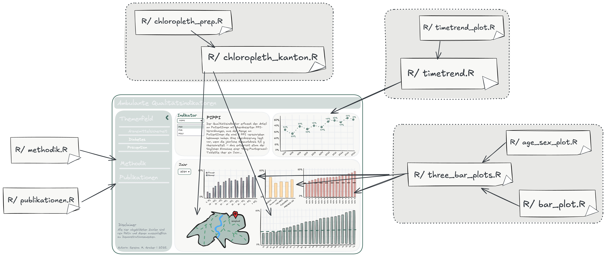

# Shiny Dashboard Skeleton

Application available [here](https://l9s1fy-sereina-graber.shinyapps.io/14_quality_dashboard/). 
**Important**: All numbers shown are purely fictional and serve exclusively for demonstration purposes.
<!-- badges: start -->
<!-- badges: end -->
### Background

The original goal of this dashboard is to monitor specific quality indicators for primary care in Switzerland. 
Of course the code is fully customizable and can be repurposed for other display needs.
The dashboard is built using R and the Shiny framework.
The repository includes *only!* the dashboard application code. For privacy and data protection reasons, 
the underlying data is not included and must be provided/ generated separately by users implementing the dashboard.
The methodologies, definitions, and detailed descriptions of all quality indicators
implemented in this dashboard are publicly available and documented in the relevant scientific literature. 
Some key publications are listed below:

* [Blozik et al. 2018](https://link.springer.com/article/10.1186/s12913-018-3477-z)
* [Blozik et al. 2022](https://bmchealthservres.biomedcentral.com/articles/10.1186/s12913-022-07893-8)
* [Farcher et al. 2024](https://journals.plos.org/plosone/article?id=10.1371/journal.pone.0311099)

### Dashboard

Prototype sketch created with [excalidraw](https://excalidraw.com/) and the [shinydraw library](https://github.com/MikeJohnPage/shinydraw) by Mike Page.

 

Dashboard built with R [{shiny}](https://shiny.posit.co/) and [{shinydashboard}](https://rstudio.github.io/shinydashboard/).

**Important**: All numbers shown in the two figures above are purely fictional and serve exclusively for demonstration purposes.

### Architecture

### Technical Notes

* `read_data.R` lives outside of the /R folder, sinced that is only used once and should not be sourced while running the app.
* color definitions: 
    - colors for the sidebar and header of the dashboard can be set in `custom.css`.
    - colors for the plots are defined in `global.R`, `age_sex_plot.R` and `bar_plot.R`.
    - to get different shades of a color, the [{monochromeR}](https://github.com/cararthompson/monochromeR) package is used as well as its [Shiny application](https://cararthompson.shinyapps.io/monochromeR/) by Cara Thompson.

